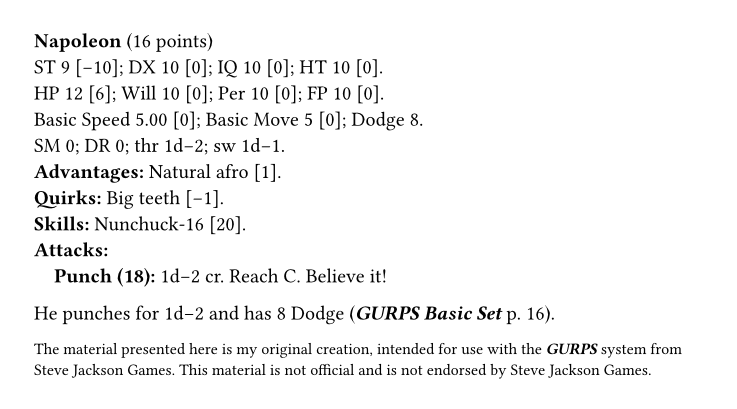

# gurps-ink

[](https://github.com/natfarleydev/gurps-typst/actions/workflows/ci.yml)


Typeset home-made ***GURPS*** material in [Typst](https://typst.app): dice
notation, book references, the Steve Jackson Games online-policy notices,
and NPC stat blocks that work out point costs for you.



```typ
#import "@preview/gurps-ink:0.1.0": *

#let napoleon = character(
  name: "Napoleon",
  st: 9, hp: 12,
  advantage("Natural afro", points: 1),
  quirk("Big teeth"),
  skill("Nunchuck", 16, "DX/E"),
  melee-attack("Punch", 18, [#dice(1, -2) cr], reach: "C",
    notes: [Believe it!]),
)

#stat-block(napoleon)

He punches for #dice(..napoleon.thr) and has
#level-of(napoleon, "Dodge") Dodge (#gurps-book("Basic Set", 16)).

#text(size: 8pt, sjgames-disclaimer)
```

You only write what differs from an average human. Attribute costs,
HP/Will/Per/FP, Basic Speed and Move, Dodge, thrust/swing damage and skill
costs are worked out from the Basic Set rules. The full manual, with every
function and its options, is [docs/manual.pdf](docs/manual.pdf).

`gurps-ink` is the successor to the LaTeX package
[gurps-latex-package](https://github.com/natfarleydev/gurps-latex-package).

## Getting started

New to Typst? It is a modern alternative to LaTeX: you write a `.typ`
file, and the compiler turns it into a PDF. There are no class files or
`\usepackage` options; a package is imported with one line and its
functions are called with `#`.

- **In the web app** ([typst.app](https://typst.app)): create a project,
  paste the example above into `main.typ`. Once the package is on Typst
  Universe it downloads itself.
- **On your computer**: [install Typst](https://github.com/typst/typst#installation),
  save the example as `npc.typ`, and run `typst compile npc.typ` (or
  `typst watch npc.typ` to rebuild on every save).

Until `gurps-ink` is published on Typst Universe, `@preview` imports will
not find it: install it locally instead (see
[Using an unreleased version](#using-an-unreleased-version)).

## What's in the box

| Function | What it does | Example |
|---|---|---|
| `gurps` | ***GURPS*** in bold italics, as SJ Games asks | `#gurps` |
| `sjgames` | "Steve Jackson Games" | `#sjgames` |
| `dice(count, modifier)` | Dice in GURPS notation; never breaks across lines | `#dice(3, -1)` → 3d−1 |
| `gurps-book(title, pages)` | Book reference in house style | `#gurps-book("Zombies", 3)` → ***GURPS Zombies*** p. 3 |
| `sjgames-disclaimer` | Disclaimer from the SJ Games online policy | `#sjgames-disclaimer` |
| `sjgames-notice` | Trademark notice from the online policy | `#sjgames-notice` |
| `sjgames-game-aid(author)` | Notice for free game aids | `#sjgames-game-aid[Jane Doe]` |
| `thrust(st)`, `swing(st)` | Basic damage from ST, as `(dice, modifier)` | `#dice(..swing(13))` → 2d−1 |
| `character(..)` | Builds a character; returns a dictionary | see above |
| `advantage`, `disadvantage`, `perk`, `quirk` | Traits for `character` | `advantage("Magery", points: 25, level: 2)` |
| `skill`, `spell` | Skills and spells; cost from points or `"DX/A"` | `skill("Stealth", 12, "DX/A")` |
| `melee-attack`, `ranged-attack` | Attacks for the stat block | `ranged-attack("Bow", 14, [1d+2 imp], range: "150/200")` |
| `stat-block(char, show-points: true, title: auto, section: auto)` | Typesets a character; hooks restyle the title and lists | `#stat-block(napoleon)` |
| `level-of(char, name)` | Level of an attribute, skill or spell | `#level-of(napoleon, "HP")` |
| `total-points(char)` | Total character points | `#total-points(napoleon)` |

### Characters in a little more detail

```typ
#import "@preview/gurps-ink:0.1.0": *

#let guard = character(
  name: "Town Guard",
  st: 12,                           // ST, DX, IQ, HT default to 10
  ht: (level: 11, points: 8),       // any cost can be overridden by hand
  per: 11,                          // bought up from IQ: costs 5
  basic-speed: 6,                   // multiples of 0.25
  dr: [2 (leather)],                // DR, SM, Dodge, thr and sw can be set too
  advantage("Combat Reflexes", points: 15),
  disadvantage("Duty (town watch)", points: -10),
  skill("Broadsword", 13, "DX/A"),  // cost from controlling attribute
  skill("Shield", 12, 2),           // or the points directly
  skill("Fast-Draw (Sword)", 14, "Broadsword/E"), // based on another skill
  melee-attack("Broadsword", 13, [#dice(..swing(12)) cut], reach: "1"),
)
#stat-block(guard, show-points: false)
```

`character()` returns a plain dictionary whose shape is documented, so
you can also quote any number from it or write your own layout; the manual
has a section on that.

Mistakes such as an unknown difficulty, a skill level too low to buy, or a
misspelt argument stop compilation with a message saying what to fix.

## Using an unreleased version

Clone this repository and run `just install` (see below). This copies the
package into your local Typst package directory; then import it with
`#import "@local/gurps-ink:0.1.0": *`.

## Contributing

You need [Typst](https://github.com/typst/typst) 0.15,
[tytanic](https://typst-community.github.io/tytanic/) 0.4 (the test runner,
command `tt`), [just](https://just.systems),
[typstyle](https://github.com/typstyle-rs/typstyle) (formatting) and
[typos](https://github.com/crate-ci/typos) (spelling).

```sh
just test          # run the tests
just update NAME   # accept new output for a picture-comparison test
just fmt           # format the Typst files
just doc           # rebuild docs/manual.pdf and docs/example.png
just ci            # everything CI runs
```

Code lives in `src/`; `src/lib.typ` decides what is public. Every public
function is documented by the `///` comments above it, which also produce
the manual. Work test-first: describe the behaviour in the doc comment, add
a failing test under `tests/`, then make it pass. `CLAUDE.md` in the
[repository](https://github.com/natfarleydev/gurps-typst) has the
conventions and the release checklist.

## Legal

The code is released under the [MIT No Attribution licence](LICENSE)
(MIT-0): use it for anything, no credit needed.

The material presented here is the original creation of Nathanael Farley,
intended for use with the [***GURPS***](http://www.sjgames.com/gurps/)
system from [Steve Jackson Games](http://www.sjgames.com/). This material
is not official and is not endorsed by Steve Jackson Games.

***GURPS*** is a registered trademark of Steve Jackson Games, and is
copyrighted by Steve Jackson Games. All rights are reserved by SJ Games.
This material is used here in accordance with the SJ Games
[online policy](http://www.sjgames.com/general/online_policy.html).
