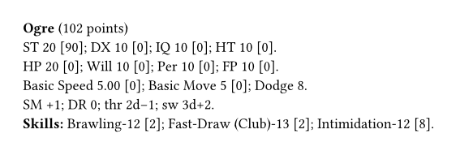

# gurps-ink

[](https://github.com/natfarleydev/gurps-typst/actions/workflows/ci.yml)


Write an unofficial ***GURPS*** sourcebook, adventure or NPC handout in
[Typst](https://typst.app). `gurps-ink` gives you:

- stat blocks that calculate their own point costs;
- dice and damage in the notation of the books;
- references to ***GURPS*** books in the house style of Steve Jackson Games;
- the notices that the Steve Jackson Games online policy asks for.

<table>
<tr>
<td>

```typ
#import "@preview/gurps-ink:0.1.0": *

#let mara = character(
  name: "Sergeant Mara Venn",
  st: 12, dx: 11, ht: 11,
  advantage("Combat Reflexes", points: 15),
  disadvantage("Duty (City Watch)", points: -10),
  skill("Broadsword", 14, "DX/A"),
  skill("Intimidation", 11, "Will/A"),
  melee-attack("Broadsword", 14,
    [#dice(..swing(12)) cut], reach: "1"),
)

#stat-block(mara)

Mara swings for #dice(..mara.sw) cut. A hero
who talks back rolls a Quick Contest
(#gurps-book("Basic Set", 348)).

#text(size: 7pt, sjgames-disclaimer)
```

</td>
<td></td>
</tr>
</table>

The [manual](docs/manual.pdf) has a tutorial, a how-to guide for each
task, and a reference for each function.

## Start

1. Open a project in the [Typst web app](https://typst.app), or
   [install Typst](https://github.com/typst/typst#installation) on your
   computer.
2. Copy the example above into `main.typ`.
3. Compile it. In the web app, the preview updates when you type. On your
   computer, run `typst watch main.typ`.

> [!NOTE]
> `gurps-ink` is not on Typst Universe yet, so the `@preview` import
> fails. Until then, install it on your computer: clone this repository
> and run `just install`. Then write
> `#import "@local/gurps-ink:0.1.0": *`.

## Functions

| Function | Use it to | Example |
|---|---|---|
| `gurps` | write ***GURPS*** in bold italics | `#gurps` |
| `sjgames` | write "Steve Jackson Games" | `#sjgames` |
| `dice(count, modifier)` | write dice; the result does not break across lines | `#dice(3, -1)` → 3d−1 |
| `gurps-book(title, pages)` | refer to a ***GURPS*** book | `#gurps-book("Zombies", 3)` → ***GURPS Zombies*** p. 3 |
| `sjgames-disclaimer` | add the disclaimer of the online policy | `#sjgames-disclaimer` |
| `sjgames-notice` | add the trademark notice of the online policy | `#sjgames-notice` |
| `sjgames-game-aid(author)` | add the notice for a free game aid | `#sjgames-game-aid[Jane Doe]` |
| `thrust(st)`, `swing(st)` | get basic damage for a ST | `#dice(..swing(13))` → 2d−1 |
| `character(..)` | make a character | see above |
| `advantage`, `disadvantage`, `perk`, `quirk` | add traits to a character | `advantage("Magery", points: 25, level: 2)` |
| `skill`, `spell` | add skills and spells to a character | `skill("Stealth", 12, "DX/A")` |
| `melee-attack`, `ranged-attack` | add attacks to a character | `ranged-attack("Bow", 14, [1d+2 imp], range: "150/200")` |
| `stat-block(char, ..)` | typeset a character | `#stat-block(mara)` |
| `level-of(char, name)` | get the level of an attribute, skill or spell | `#level-of(mara, "HP")` |
| `total-points(char)` | get the point total of a character | `#total-points(mara)` |

## Point costs

Give the level of each attribute, skill and spell. `character()`
calculates the point costs. To use a different cost, give it:

<table>
<tr>
<td>

```typ
#import "@preview/gurps-ink:0.1.0": *

#let ogre = character(
  name: "Ogre",
  sm: 1,
  // Give your own cost, e.g. for an SM discount.
  st: (level: 20, points: 90),
  // Write a skill cost as points...
  skill("Brawling", 12, 2),
  // ...or as attribute and difficulty.
  skill("Intimidation", 12, "Will/A"),
  // A skill can be based on another skill.
  skill("Fast-Draw (Club)", 13, "Brawling/E"),
)
#stat-block(ogre)
```

</td>
<td></td>
</tr>
</table>

If an input is wrong, compilation stops. The error message tells you
what to change.

## Contributing

You need [Typst](https://github.com/typst/typst) 0.15,
[tytanic](https://typst-community.github.io/tytanic/) 0.4 (the test runner,
command `tt`), [just](https://just.systems),
[typstyle](https://github.com/typstyle-rs/typstyle) (formatting) and
[typos](https://github.com/crate-ci/typos) (spelling).

```sh
just test          # run the tests
just update NAME   # accept new output for a picture-comparison test
just fmt           # format the Typst files
just doc           # rebuild docs/manual.pdf and the pictures in docs/
just ci            # everything CI runs
```

The code is in `src/`. `src/lib.typ` decides what is public. The `///`
comment above each public function documents it, and the manual shows
these comments. Work test-first: write the behaviour in the comment, add a
failing test in `tests/`, then make the test pass. `CLAUDE.md` in the
[repository](https://github.com/natfarleydev/gurps-typst) has the
conventions and the release checklist.

## Legal

The code is released under the [MIT No Attribution licence](LICENSE)
(MIT-0): use it for anything, no credit needed.

The material presented here is the original creation of Nathanael Farley,
intended for use with the [***GURPS***](http://www.sjgames.com/gurps/)
system from [Steve Jackson Games](http://www.sjgames.com/). This material
is not official and is not endorsed by Steve Jackson Games.

***GURPS*** is a registered trademark of Steve Jackson Games, and is
copyrighted by Steve Jackson Games. All rights are reserved by SJ Games.
This material is used here in accordance with the SJ Games
[online policy](http://www.sjgames.com/general/online_policy.html).
