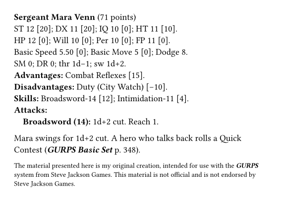

# gurps-ink

[](https://github.com/natfarleydev/gurps-ink/actions/workflows/ci.yml)


A [Typst](https://typst.app) package for people who write unofficial
***GURPS*** material: a sourcebook, an adventure or a handout. It does
three things:

- **Legal notices.** It gives you the disclaimer and the notice that the
  Steve Jackson Games [online policy](https://www.sjgames.com/general/online_policy.html)
  asks for, and writes ***GURPS*** in bold italics.
- **Dice and book references.** It writes dice (3d, 2d−1), damage from
  ST, and references such as ***GURPS Magic*** p. 14.
- **Characters.** It makes stat blocks that calculate their point costs.

```typ
#import "@preview/gurps-ink:0.1.0": *

#let hare = character(
  name: "The Hare",
  st: 6, dx: 13, ht: 11,
  sm: -2,
  basic-move: 9,
  disadvantage("Overconfidence (12)", points: -5),
  quirk("Naps after lunch"),
  skill("Running", 16, "HT/A"),
  melee-attack("Kick", 13, [#dice(..thrust(6)) cr], reach: "C"),
)

#stat-block(hare)

The Hare rolls #dice(3) to stay awake. Its kick does
#dice(..hare.thr) cr (#gurps-book("Basic Set")).

#text(size: 7pt, sjgames-disclaimer)
```



## Not a GURPS look-alike

`gurps-ink` does not copy the look of ***GURPS*** books. The
[online policy](https://www.sjgames.com/general/online_policy.html)
(section II) says that material that looks like a Steve Jackson Games
product is "over the line". `gurps-ink` follows the typographic rules of
Steve Jackson Games, from its
[Authors' Guidelines](https://www.sjgames.com/general/guidelines/authors/style.html)
and its books: how to write dice, book titles and stat blocks. It sets
no fonts, colours or page layout. You choose them.

`gurps-ink` gives you the text of the notices. It does not give legal
advice. Read the online policy before you publish.

## Documentation

- The [manual](docs/manual.pdf) is a user guide and a reference. It has
  one chapter for each of the three things above. Each chapter starts
  with the questions that it answers.
- [The Tortoise and the Hare](docs/tortoise-and-hare.pdf) is an example
  one-shot adventure made with `gurps-ink`. Its source is
  `docs/example/tortoise-and-hare.typ` in the [repository](https://github.com/natfarleydev/gurps-ink).

## Install

`gurps-ink` is not on Typst Universe yet, so the `@preview` import does
not work yet. Until then, install it on your computer:

1. Install [Typst](https://github.com/typst/typst#installation) and
   [just](https://just.systems).
2. Clone this repository and run `just install`.
3. In your document, write `#import "@local/gurps-ink:0.1.0": *`.

## Functions

| Function | Use it to |
|---|---|
| `sjgames-disclaimer` | add the disclaimer from the online policy |
| `sjgames-notice` | add the trademark notice from the online policy |
| `sjgames-game-aid(author)` | add a notice for a free game aid |
| `gurps`, `sjgames` | write ***GURPS*** in bold italics, or "Steve Jackson Games" |
| `dice(count, modifier)` | write dice, such as `#dice(2, -1)` for 2d−1 |
| `thrust(st)`, `swing(st)` | get the basic damage for a ST, such as `#dice(..swing(13))` |
| `gurps-book(title, pages)` | refer to a ***GURPS*** book, such as `#gurps-book("Magic", 14)` for ***GURPS Magic,*** p. 14 |
| `basic-set(pages)` | refer to a page of the _Basic Set_, such as `#basic-set(348)` for p. B348 |
| `character(..)` | make a character and calculate its costs |
| `advantage`, `disadvantage`, `perk`, `quirk` | add traits to a character |
| `skill`, `spell` | add skills and spells to a character |
| `melee-attack`, `ranged-attack` | add attacks to a character |
| `stat-block(char, ..)` | show a character as a stat block |
| `level-of(char, name)` | get the level of an attribute, skill or spell |
| `total-points(char)` | get the point total of a character |

The [manual](docs/manual.pdf) gives the arguments of each function.

## Contributing

You need [Typst](https://github.com/typst/typst) 0.15,
[tytanic](https://typst-community.github.io/tytanic/) 0.4 (the test runner,
command `tt`), [just](https://just.systems),
[typstyle](https://github.com/typstyle-rs/typstyle) (formatting) and
[typos](https://github.com/crate-ci/typos) (spelling).

```sh
just test          # run the tests
just update NAME   # accept new output for a picture-comparison test
just fmt           # format the Typst files
just doc           # rebuild the manual, the example and the pictures
just ci            # everything CI runs
```

The code is in `src/`. `src/lib.typ` decides what is public. The `///`
comment above each public function documents it, and the manual shows
these comments. Work test-first: write the behaviour in the comment, add a
failing test in `tests/`, then make the test pass. `CLAUDE.md` in the
[repository](https://github.com/natfarleydev/gurps-ink) has the
conventions and the release checklist.

## Legal

The code is released under the [MIT No Attribution licence](LICENSE)
(MIT-0): use it for anything, no credit needed.

The material presented here is the original creation of Nathanael Farley,
intended for use with the [***GURPS***](http://www.sjgames.com/gurps/)
system from [Steve Jackson Games](http://www.sjgames.com/). This material
is not official and is not endorsed by Steve Jackson Games.

***GURPS*** is a registered trademark of Steve Jackson Games, and is
copyrighted by Steve Jackson Games. All rights are reserved by SJ Games.
This material is used here in accordance with the SJ Games
[online policy](http://www.sjgames.com/general/online_policy.html).
